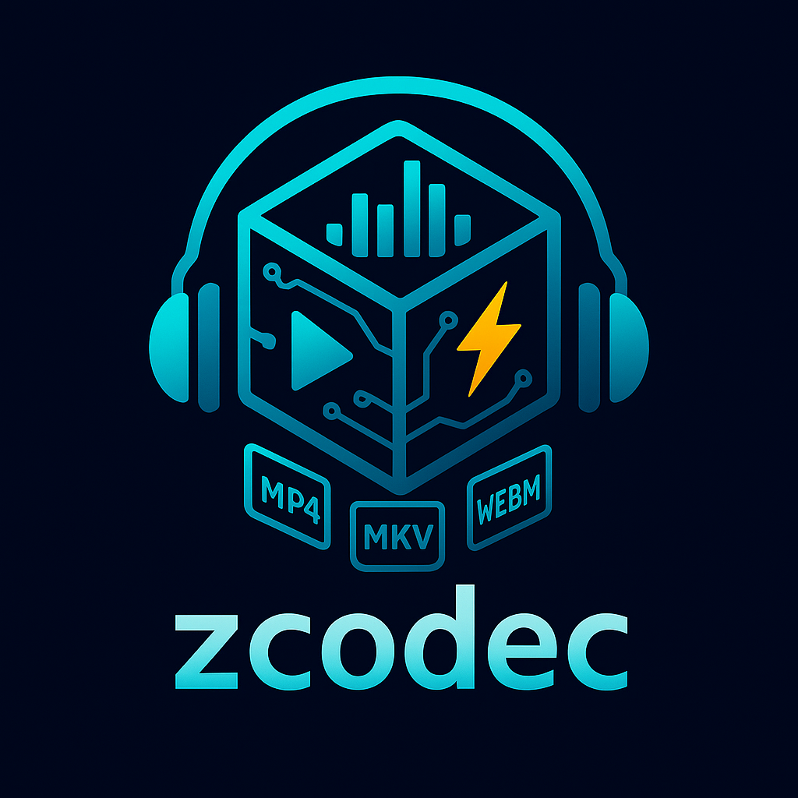

# zcodec

<div align="center">
  
</div>

<div align="center">


## DISCLAIMER ⚠️ EXPERIMENTAL LIBRARY - FOR LAB/PERSONAL USE ⚠️
This is an experimental library under active development. It is intended for research, learning, and personal projects. The API is subject to change!

</div>

## Overview

**zcodec** is a pure Zig audio codec library focused on performance, safety, and simplicity. Built with zero dependencies, it provides comprehensive support for audio file formats, encoding/decoding, and metadata handling.

## Features

### Current MVP
- ✅ **WAV Format Support** - Complete WAV file reading and writing
- ✅ **PCM Encoding/Decoding** - Support for 16-bit, 24-bit, 32-bit PCM and IEEE float
- ✅ **Metadata Reading** - Basic WAV INFO chunk metadata extraction
- ✅ **Memory Safe** - Leverages Zig's compile-time memory safety guarantees
- ✅ **Zero Dependencies** - Pure Zig implementation

### Roadmap
- 🔄 **Lossless Formats** - FLAC, AIFF, APE, WavPack
- 🔄 **Lossy Formats** - MP3, AAC, Ogg Vorbis, Opus
- 🔄 **Advanced Metadata** - ID3, Vorbis Comments, APE tags, cover art
- 🔄 **Progressive Decoding** - Streaming and seeking capabilities
- 🔄 **Gapless Playback** - Seamless audio transitions
- 🔄 **Psychoacoustic Models** - High-quality encoding algorithms

## Quick Start

### Installation

Add zcodec to your project using `zig fetch`:

```bash
zig fetch --save https://github.com/ghostkellz/zcodec/archive/refs/heads/main.tar.gz
```

### Basic Usage

```zig
const std = @import("std");
const zcodec = @import("zcodec");

pub fn main() !void {
    var gpa = std.heap.GeneralPurposeAllocator(.{}){};
    defer _ = gpa.deinit();
    const allocator = gpa.allocator();

    // Read a WAV file
    const result = try zcodec.readWavFile(allocator, "input.wav");
    defer {
        result.wav_file.deinit();
        var decoder = zcodec.PcmDecoder.init(allocator, &result.wav_file);
        decoder.deinit(result.samples);
        result.metadata.deinit(allocator);
    }

    std.debug.print("Sample Rate: {}\n", .{result.wav_file.header.sample_rate});
    std.debug.print("Channels: {}\n", .{result.wav_file.header.num_channels});
    std.debug.print("Duration: {:.2}s\n", .{result.wav_file.getDurationSeconds()});

    if (result.metadata.title) |title| {
        std.debug.print("Title: {s}\n", .{title});
    }

    // Create a new WAV file with the same samples
    try zcodec.writeWavFile(
        allocator,
        "output.wav",
        result.samples,
        result.wav_file.header.sample_rate,
        result.wav_file.header.bits_per_sample,
    );
}
```

### Creating Audio from Scratch

```zig
const std = @import("std");
const zcodec = @import("zcodec");

pub fn main() !void {
    var gpa = std.heap.GeneralPurposeAllocator(.{}){};
    defer _ = gpa.deinit();
    const allocator = gpa.allocator();

    // Generate a 440Hz sine wave for 1 second
    const sample_rate = 44100;
    const duration = 1.0;
    const sample_count = @as(usize, @intFromFloat(sample_rate * duration));

    const samples = try allocator.alloc(zcodec.Sample, sample_count);
    defer allocator.free(samples);

    for (samples, 0..) |*sample, i| {
        const t = @as(f32, @floatFromInt(i)) / @as(f32, @floatFromInt(sample_rate));
        const freq = 440.0; // A4
        const amplitude = 0.5;
        sample.* = zcodec.Sample{ .f32 = amplitude * @sin(2.0 * std.math.pi * freq * t) };
    }

    // Create mono channel
    var channels = [_][]zcodec.Sample{samples};

    // Write to WAV file
    try zcodec.writeWavFile(allocator, "sine_wave.wav", &channels, sample_rate, 32);
}
```

## API Reference

### Core Types

- `WavFile` - Represents a WAV audio file
- `Sample` - Union type for different sample formats (i16, i24, i32, f32)
- `PcmDecoder` - Decodes PCM audio data to samples
- `PcmEncoder` - Encodes samples to PCM audio data
- `WavMetadata` - Container for WAV file metadata
- `AudioReader`/`AudioWriter` - Low-level file I/O abstractions

### Main Functions

- `readWavFile(allocator, path)` - Read and decode a WAV file
- `writeWavFile(allocator, path, samples, sample_rate, bits_per_sample)` - Create a WAV file

## Building

```bash
# Build the library
zig build

# Run tests
zig build test

# Run the example
zig build run
```

## Requirements

- Zig 0.16.0-dev or later

## Contributing

Contributions are welcome! Please ensure all tests pass and follow the existing code style.

## License

[License details to be added]
